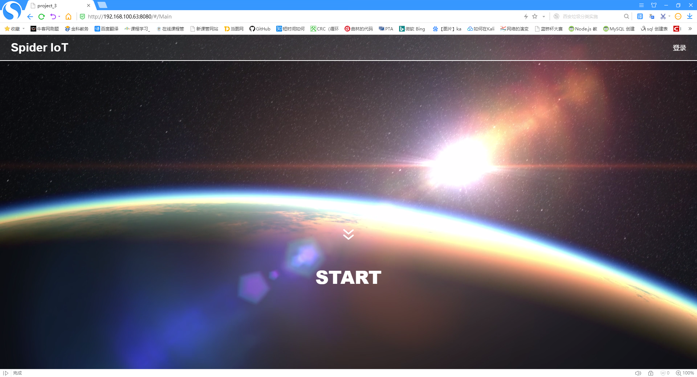
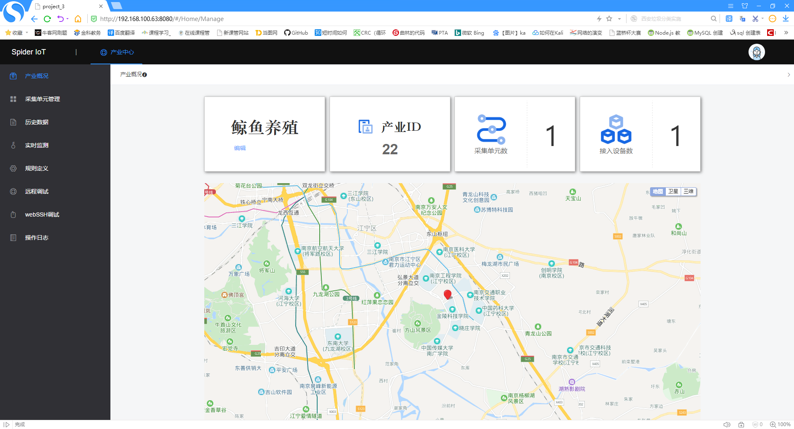
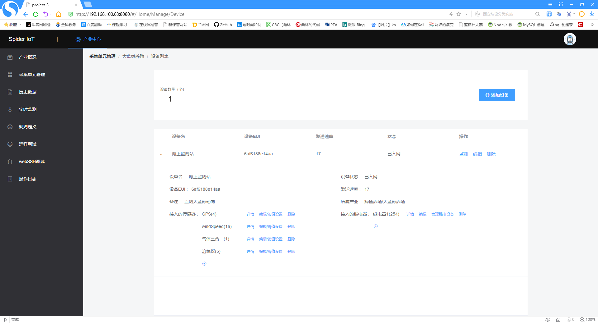
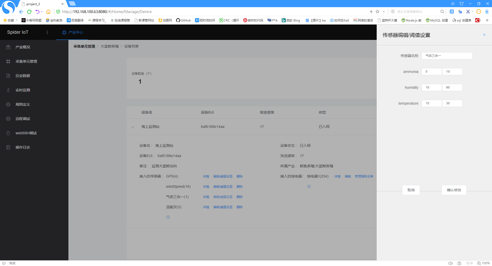
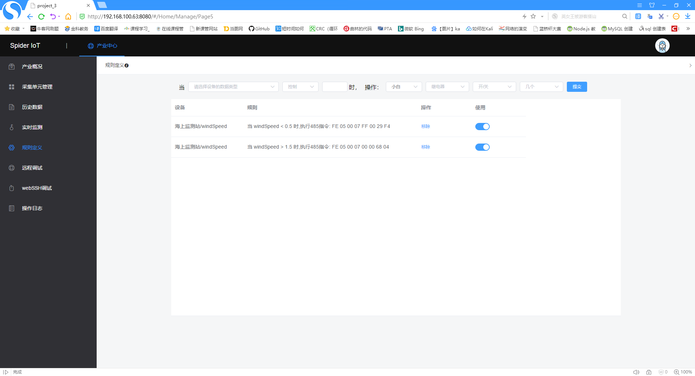
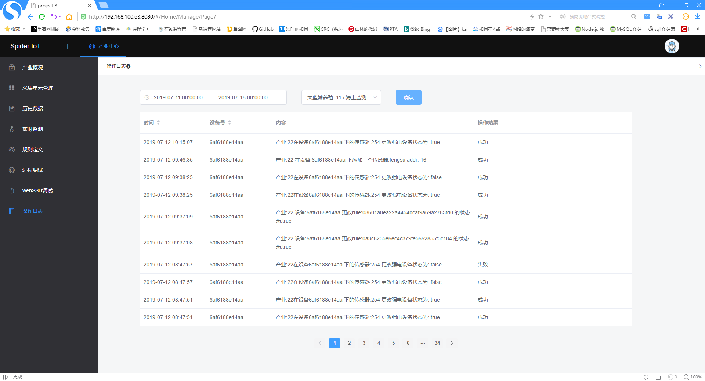

EN / [CN](./README_CN.md)

# spider_IoT_platform
An IoT platform project, for 2019 Jinling Institute of Science and Technology Development Competition

### Team Members ###
WANG JIAHUA, [LI KECHEN](https://github.com/dxlkc), ZHAO ZELIANG, GU YUQING, ZHANG HAOYUE

### Introduction ###
Spider IoT is an IoT management platform. Users can make terminal devices connect to the server, and connect some sensors and relays to devices. Then the environmental data can be observed on the website, and users can perform some control actions.
Users can set some thresholds for a sensor of a terminal device. When the environmental data reaches the threshold, the server will send an alert SMS to the mobile phone number set by the user, or execute the control behavior set in advance by the user (such as turning on the fan when the temperature reaches a high threshold).
A very convenient function is that as long as the sensor uses the RS485 communication protocol, after the user physically connects the sensor to the device, he can configure the device on the website according to the sending format of the sensor, and then the server will issue commands to let the device start getting data normally.
In addition, we have also implemented the function of remote debugging terminal, and users can access the terminal of the terminal device through WebSSH on the page.

### Technology Stack ###
**Backend:** JAVA, SpringBoot, SpringCloud, MQTT, Redis, MongoDB, InfluxDB, MySQL, Mybatis 

**Frontend:** HTML, CSS, JavaScript, Vue, Websocket, Element-UI, Baidu-Map, ECharts

**Device:** C++, SQLite3, RE-485, BASE64

### Data Relationship ###

### Server Architecture ###

### Terminal Device Architecture ###

### Website Screenshots ###

