[EN](./README.md) / CN

# spider_IoT_platform
An IoT platform project, for 2019 Jinling Institute of Science and Technology Development Competition

### 团队成员 ###
王 JH，李 KC，赵 ZL，顾 YQ，张 HY

### 项目介绍 ###
Spider IoT一个物联网管理平台，用户能够在线接入终端设备，传感器，继电器，通过页面来观察环境数据的变化，以及做出一定程度上的控制行为。
用户能够针对某个终端的一个传感器设置一些阈值，当环境数据达到阈值时服务器会向用户设置的手机号发送警报短信，或者是执行用户提前设置的控制行为（比如在温度达到一定阈值时打开电扇）。
一个非常便利的功能是，只要传感器使用的是RS485通信协议，用户在物理上把传感器接到设备上之后，可以直接在网页上根据传感器的发送格式来配置设备，之后服务器会下发指令让设备开始正常获取数据。
另外，我们还实现了远程调试终端的功能，用户能够在页面上通过WebSSH来访问终端设备的终端。

### 技术栈 ###
**Backend:** JAVA, SpringBoot, SpringCloud, MQTT, Redis, MongoDB, InfluxDB, MySQL, Mybatis 

**Frontend:** HTML, CSS, JavaScript, Vue, Websocket, Element-UI, Baidu-Map, ECharts

**Device:** C++, SQLite3, RE-485, BASE64

### 数据关系 ###
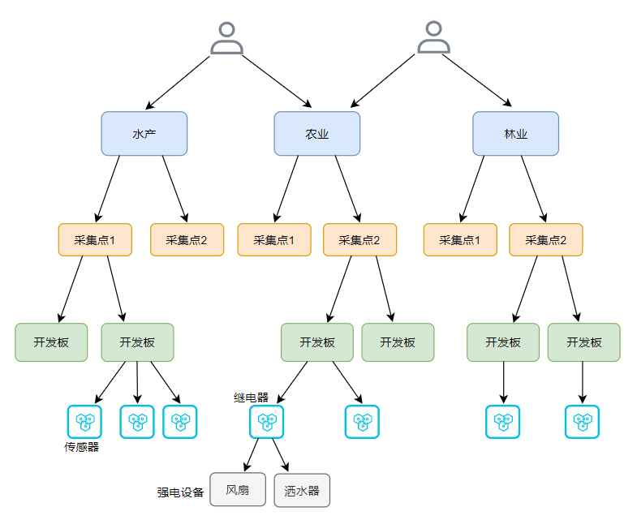
### Server架构 ###
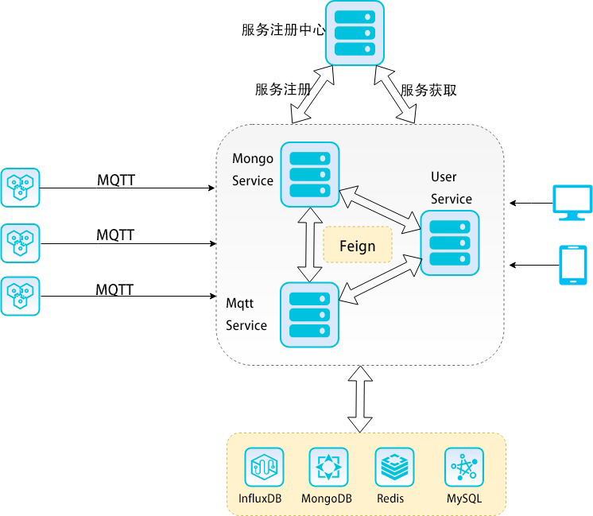
### 终端架构 ###
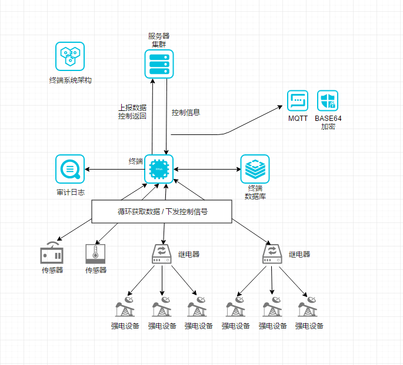

### 页面截图 ###
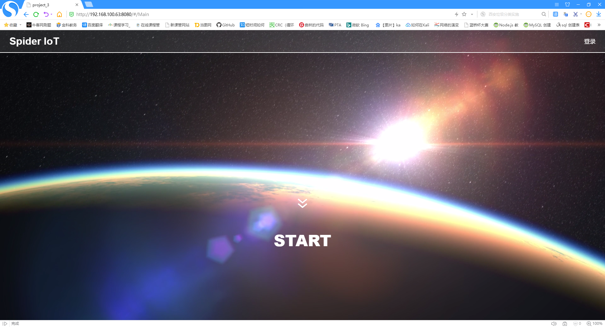
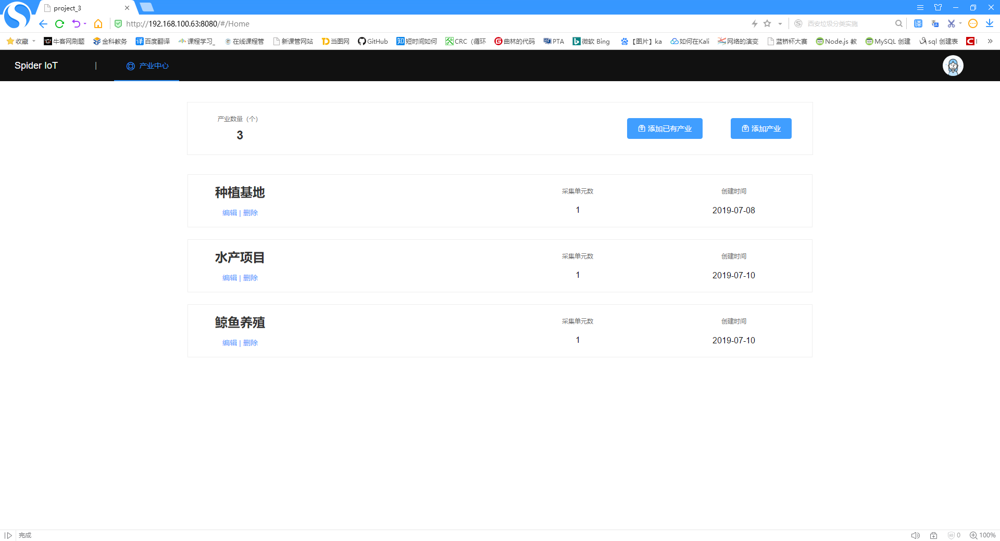
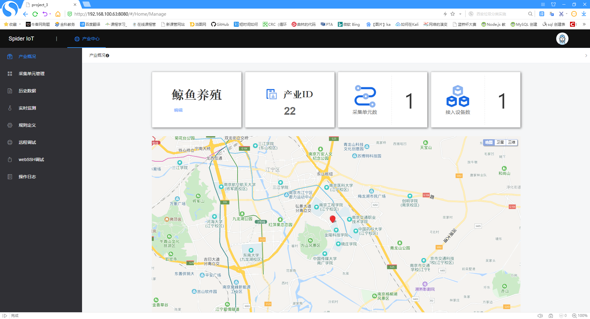
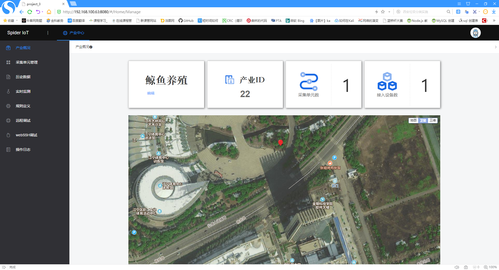
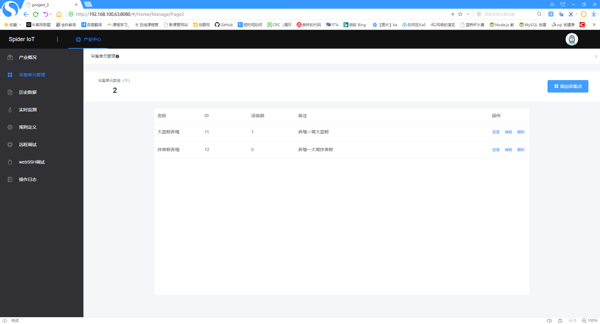
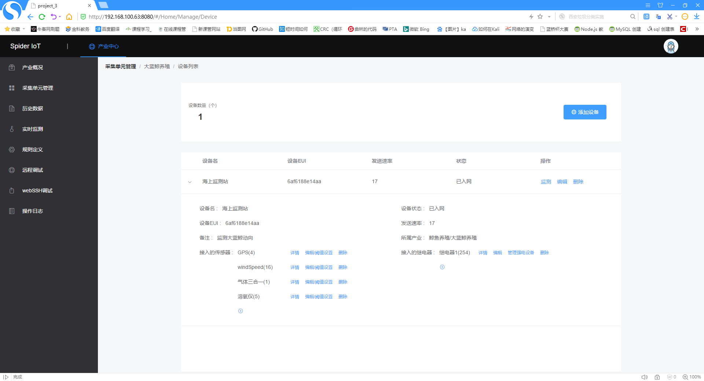
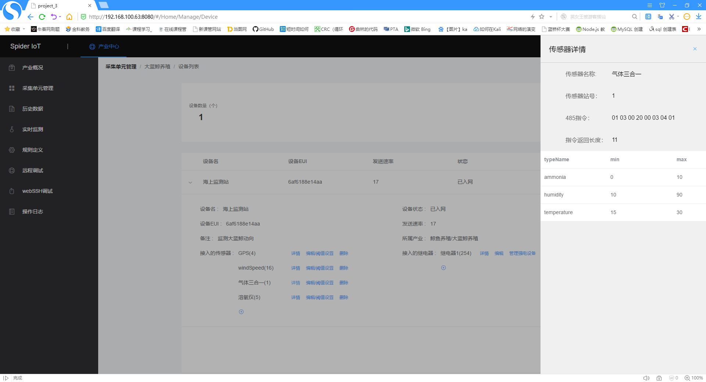
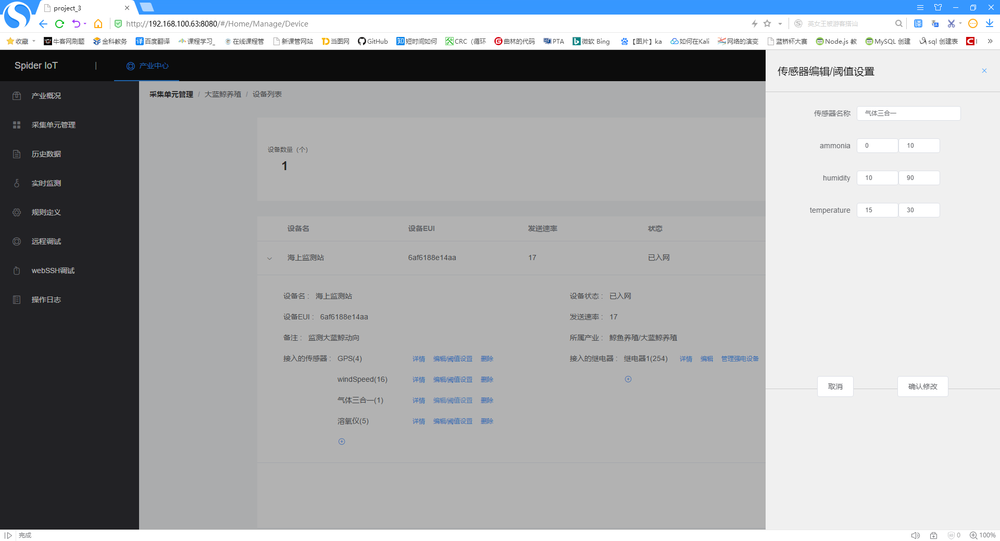
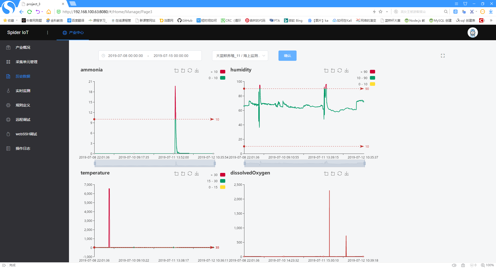
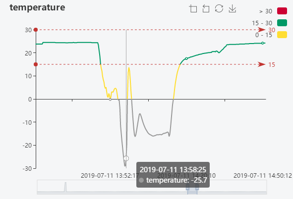
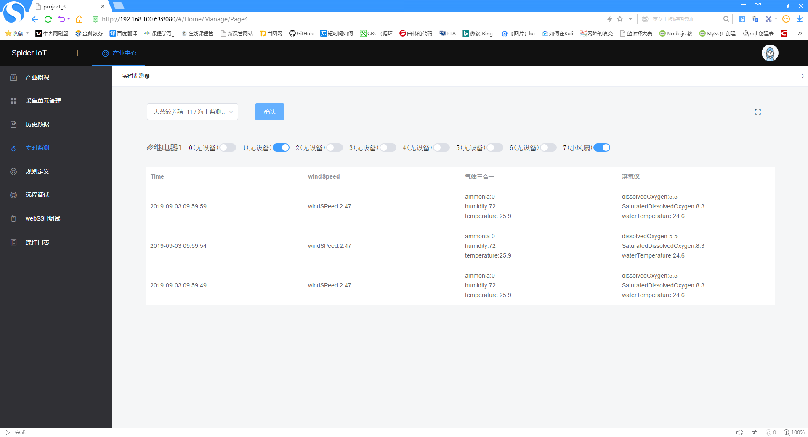

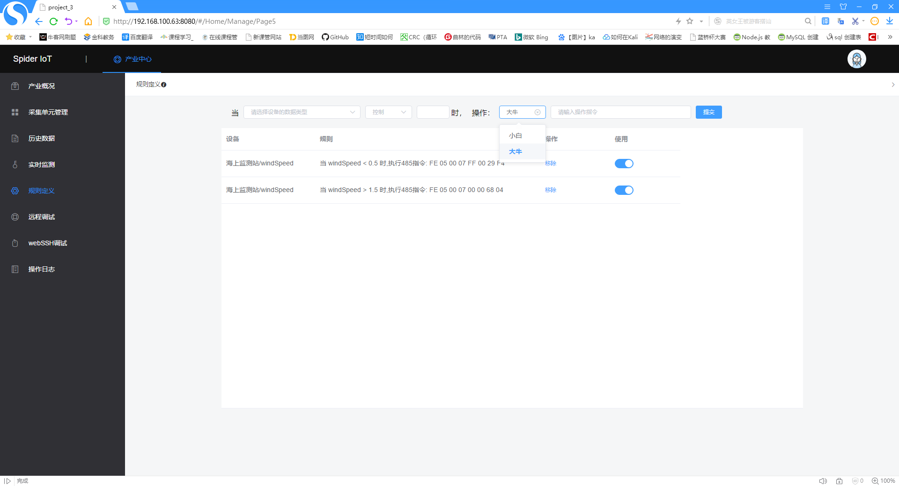
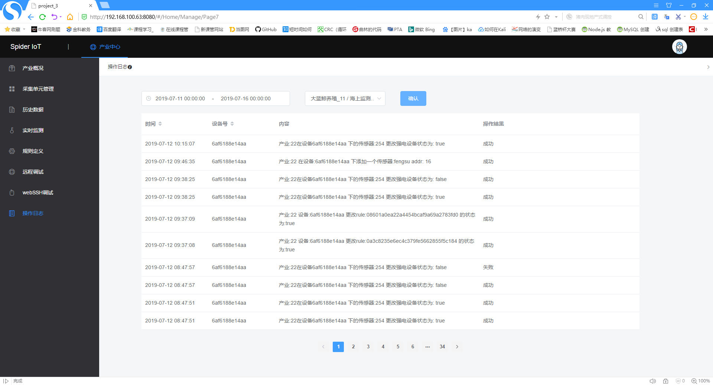
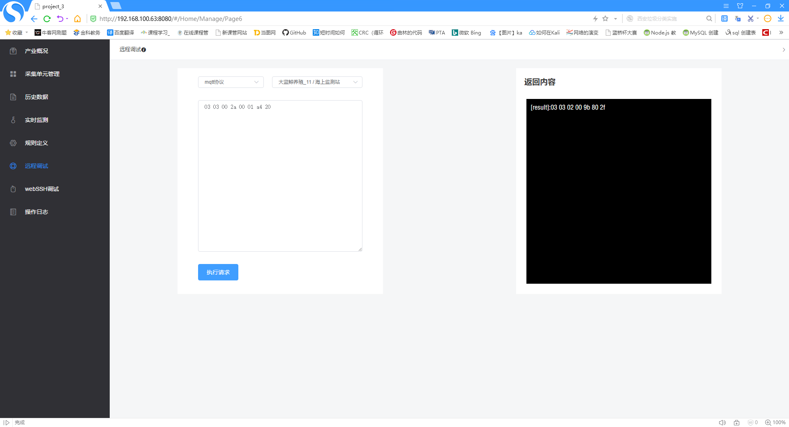
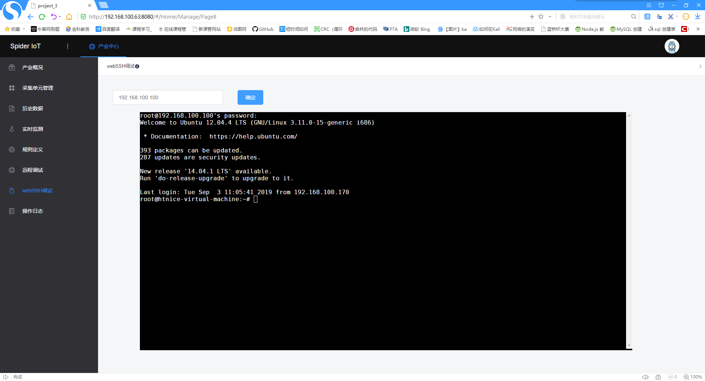

